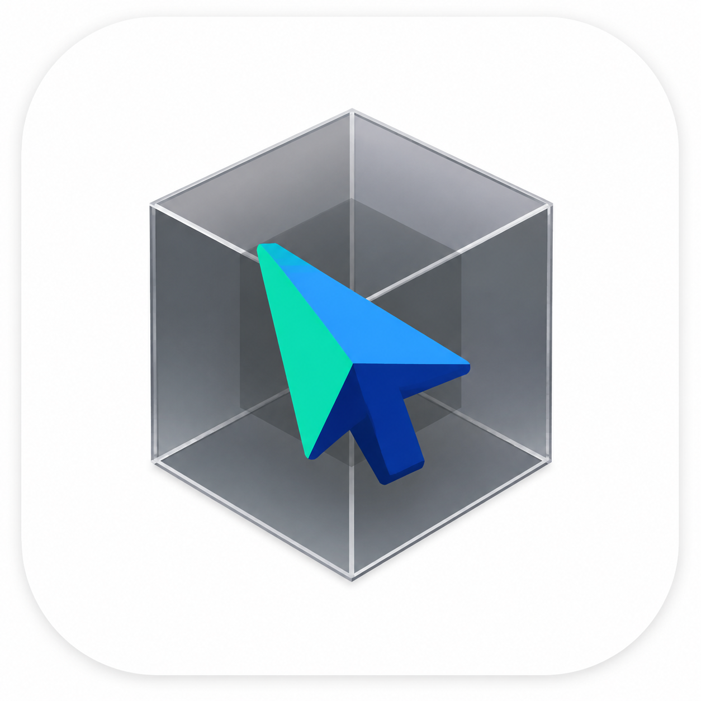
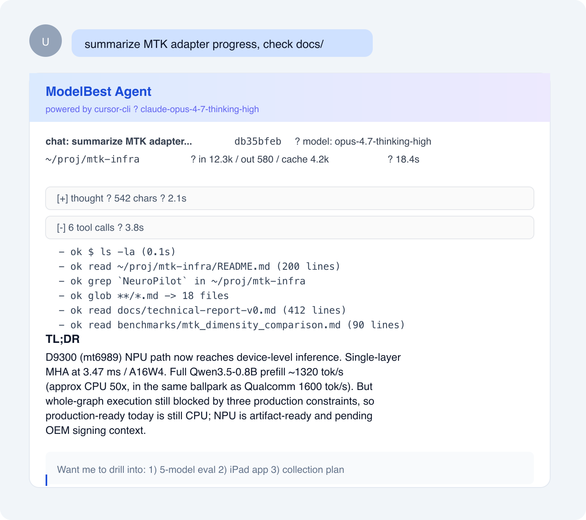

<p align="center">
  
</p>

<h1 align="center">Larksor-TC</h1>

<p align="center">
  <b>L</b>ark&nbsp;·&nbsp;<b>C</b>ursor&nbsp;·&nbsp;<b>T</b>erminal&nbsp;·&nbsp;<b>C</b>onnect
</p>

<p align="center">
  Drive your Mac's <a href="https://cursor.com">Cursor</a> + <b>Opus 4.7 Thinking High</b> from <a href="https://www.larksuite.com">Feishu / Lark</a> chat.<br>
  Anywhere with a phone. Same seat, same bill, same model.
</p>

<p align="center">
  
  
  
  
  
</p>

---

## ⚡ 30-second pitch

<table align="center">
<tr>
<td align="center" width="33%">
  <h3>📱</h3>
  <b>You</b><br>
  <sub>phone / iPad / cafe<br>external network</sub>
</td>
<td align="center" width="34%">
  <h3>↔️</h3>
  <b>Feishu DM</b><br>
  <sub>compliant channel<br>already on the allowlist</sub>
</td>
<td align="center" width="33%">
  <h3>🖥️</h3>
  <b>Your office Mac</b><br>
  <sub>Cursor team seat<br>Opus 4.7 Thinking High</sub>
</td>
</tr>
</table>

<p align="center">
  <i>Extend the Opus seat you already pay for, to every device you can open Feishu on.</i>
</p>

---

## 👀 What it looks like

<p align="center">
  
</p>

<sub align="center">

streaming typewriter answer · collapsible thinking panel · collapsible tool-calls panel · token + elapsed in meta line  
*(rendered mockup; real screenshots welcome via PR)*

</sub>

---

## 🏗 Architecture


Mac only initiates **outbound** connections — no public IP, no VPN, no reverse proxy.

---

## 🚀 Quick start

| step | who    | time   | what                                                                       |
| ---- | ------ | ------ | -------------------------------------------------------------------------- |
| 1    | you    | 5 min  | create a Feishu app at https://open.feishu.cn/app, grab App ID + Secret    |
| 2    | Cursor | 1 min  | paste the install prompt below into your Cursor IDE chat                   |
| 3    | done   |  —     | DM your bot from Feishu, get streaming Opus replies anywhere               |

```bash
# manual install
git clone https://github.com/HenryZ838978/Larksor-TC.git ~/larksor-tc
LARK_APP_ID=cli_xxxxxxxxxxxxxxxx \
LARK_APP_SECRET=xxxxxxxxxxxxxxxx \
bash ~/larksor-tc/install.sh
```

For the **Cursor agent-driven install**, paste this into your Cursor chat:

````text
I want to install Larksor-TC. Please:

1. Check that ~/larksor-tc/ exists (bridge.py, install.sh, README.md should be there).
   If not, tell me to `git clone https://github.com/HenryZ838978/Larksor-TC.git ~/larksor-tc`.

2. Get my display name: `git config user.name || whoami | head -c 20`. Call this $MY_NAME.

3. Run `open https://open.feishu.cn/app` to open the Feishu dev console in my browser.
   Walk me through (from README "Step 1") how to:
     - create an enterprise self-built app named "${MY_NAME}的飞书CLI"
     - enable bot capability
     - add scopes: im:message, im:message:send_as_bot, cardkit:card:write
     - subscribe events: im.message.receive_v1, card.action.trigger
     - submit for internal approval
     - copy App ID + App Secret

4. When I paste App ID + Secret back, run:
   `LARK_APP_ID=<id> LARK_APP_SECRET=<secret> bash ~/larksor-tc/install.sh`

5. Show me the last 20 lines of the installer output.

6. Tell me to DM the bot from Feishu with "hi" and after 30s
   `tail -n 20 ~/larksor-tc/bridge.log` to confirm I see `<- ou_...:` and `SDK ws client starting`.

Notes: secret only via env var + 0600 file, install.sh is idempotent, never commit secrets.env.
````

---

## 🎯 Why this exists

|                                            | Without Larksor-TC          | With Larksor-TC                  |
| ------------------------------------------ | --------------------------- | -------------------------------- |
| Use Opus 4.7 Thinking when not at your Mac | $$$ direct API / rate-limited 3rd party | $0 incremental, uses your paid Cursor seat |
| Talk to private code from outside          | VPN + RDP + corporate proxy | Feishu DM (already on allowlist) |
| Agent run interrupted while you're out     | wait until you're back      | retry / cancel / switch from phone |
| Demo result to a teammate                  | walk over to your screen    | paste a Feishu message in a group |

---

## 🧰 What's inside

- 🎴 **CardKit v2 streaming card** — typewriter token output, markdown / code blocks, 10 ops/s update cap
- 💭 **Thinking panel** — collapsed by default; auto-fills if model emits reasoning (opus / sonnet thinking)
- 🔧 **Tool-calls panel** — live during run (shell / read / edit / grep / glob / mcp / ...), auto-collapses on result
- 📷 **Image messages** — phone screenshot → DM → auto-saved to `~/larksor-tc/inbox/` → next prompt auto-attaches → opus reads it
- 📁 **Per-chat workspace** — `/cd ~/proj/foo` or natural-language `切到 ~/proj/foo`, persisted per chat
- 🪙 **Token + cost tracking** — SQLite per-turn metrics; `/cost today` / `/history N`
- 💬 **Chat management** — `/ls` / `/resume <N>` / `/new`; title auto-derived from first prompt
- ⚙️ **launchd autostart + caffeinate** — survives reboot, prevents idle-sleep while running
- 🚦 **Hard limits** — 15-min agent timeout, `resource_exhausted` hint, non-empty failure card
- 🌐 **lark-oapi SDK direct** — no `lark-cli` subprocess cold-start, button callbacks return toasts correctly

---

## 📜 Commands cheat sheet

```text
# switch
/model opus              alias: opus | sonnet | gpt5 | codex | auto
/cd ~/proj/mtk-infra     per-chat workspace
/new                     new chat
/resume 3                switch to /ls position 3

# info
/help     /status     /history 5     /cost today     /ls

# act
/include path/to/file    attach a Mac file to the NEXT prompt
/retry                   re-run last prompt
/cancel                  SIGINT the running agent
/plan <prompt>           plan mode (read-only / planning)
/ask  <prompt>           ask mode (Q&A read-only)

# Chinese natural-language (also accepted)
换模型 opus      切到 ~/proj/foo      用 sonnet 模型
```

---

## 🔧 Maintenance

```bash
tail -f ~/larksor-tc/bridge.log                           # live log
launchctl kickstart -k gui/$UID/cn.modelbest.larksor-tc   # restart
launchctl bootout    gui/$UID/cn.modelbest.larksor-tc     # stop until next login
bash ~/larksor-tc/uninstall.sh                            # uninstall
bash ~/larksor-tc/uninstall.sh --purge                    # uninstall + drop history
```

For Opus 4.7 access, set Max Mode in `~/.cursor/cli-config.json`:

```json
{ "maxMode": true, "model": { "maxMode": true } }
```

---

## 🗺 Roadmap

| Phase | Status     | Highlights                                                                |
| ----- | ---------- | ------------------------------------------------------------------------- |
| 1     | ✅ alpha    | cursor-cli backend, single-user self-host, mdou skill for internal distro |
| 2     | 🚧 planned | pluggable executor: Claude Code / Codex / DeepSeek-harness; group @ mode  |
| 3     | 🌱 maybe   | org-level cost dashboard, multi-user chats, Cloud Agent handoff           |

---

## 🙏 Credits

- [Cursor](https://cursor.com) — the IDE this thing borrows compute from
- [Lark Open Platform](https://open.feishu.cn) — the rails this runs on
- [`@HenryZ838978/deepseek-harness`](https://github.com/HenryZ838978/deepseek-harness) — sibling project; same dark humor, different beast
- [ModelBest](https://modelbest.cn) — for letting me dogfood this internally

<p align="center">
  <sub>
    ⭐ <b>If this saved you a single train ride back to the office, star the repo.</b> That's the whole ask.<br>
    PRs / issues welcome. Don't commit your <code>secrets.env</code>.
  </sub>
</p>
