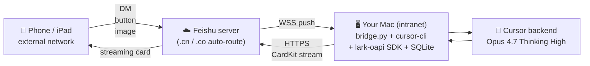

<p align="center">
  
</p>

<h1 align="center">Larksor-TC</h1>

<p align="center">
  <b>L</b>ark&nbsp;·&nbsp;<b>C</b>ursor&nbsp;·&nbsp;<b>T</b>erminal&nbsp;·&nbsp;<b>C</b>onnect<br>
  <sub>Drive your office Mac's <b>Cursor + Opus 4.7 Thinking High</b> from a Feishu DM. Anywhere.</sub>
</p>

<p align="center">
  
  
  
  
  
  
</p>

<p align="center">
  <b>🇨🇳 简体中文（默认）</b> &nbsp;·&nbsp;
  <a href="#english"><b>🇬🇧 English</b></a>
</p>

---

## 😩 痛点

> 你在外地，公司 Mac 在工位，Cursor + Opus 4.7 还在那台 Mac 上等你。

- **手机 / iPad 上根本用不了 Opus**。Cursor 没移动端，第三方 Web 大多被公司网络墙了，直连 Anthropic API 又贵又限速。
- **VPN + 远程桌面太重**，开个会还得先连一堆东西，体验和"远程改代码"差十万八千里。
- **Agent 跑到一半你出门了**？回来还得对着 100 条对话翻找上下文。
- **想让同事看个结果**，最快的办法居然是回工位截屏发飞书。

## 💡 解决

**Larksor-TC** 是一根 ~2000 行 Python 的桥：

> 飞书消息 ⇄ 你 Mac 上的 Cursor CLI agent。

- **零额外费用** —— 复用你已经付钱的 Cursor 工位，没有第二份 Opus token 账单。
- **零公网暴露** —— Mac 只主动出站（飞书 WSS），无需公网 IP、VPN、反向代理。
- **零运维** —— `launchd` 开机自启 + `caffeinate -dimsu` 防睡眠，关盖也能用。
- **一份合规通道** —— 飞书本来就在公司白名单，IT 不用单独审批。

## ✨ 体验

<p align="center">
  
</p>

打开飞书，给 bot 发条消息，你会看到一张**流式卡片**：

- 💭 **思考过程** —— Opus thinking 实时打字（可折叠）
- 📋 **Todo 计划** —— Agent 制定计划时自动展开，做完 ~~划掉~~
- 🔧 **工具调用** —— shell / read / edit / grep / mcp 实时进度，结束自动折叠
- 📷 **图片** —— 手机截图直接拖进飞书，下一轮自动作为多模态输入
- 🪙 **Token & 耗时** —— 标题栏实时显示，免得跑超了不知道

自然语言开新对话、切模型、改工作区：

```text
新对话                  → /new
换模型 opus            → /model opus
切到 ~/proj/mtk-infra   → /cd ~/proj/mtk-infra
```

完整命令清单见下文 [📜 命令速查](#-命令速查)。

---

## 🚀 30 秒安装

### 方式 A：把这段甩给你自己的 Cursor（推荐）

```
请按 Larksor-TC 项目里的 HANDOFF.md 给我装一下。
仓库地址：https://github.com/HenryZ838978/Larksor-TC

第一步先 git clone 到 ~/larksor-tc，然后严格按 HANDOFF.md 的 5 个 Phase 走，
每个 STOP 门都停下问我。我在国内（如果在国外，把 MIRROR_MODE 设成 intl）。
```

你的 Cursor / Claude Code / Codex CLI 会读 [`HANDOFF.md`](HANDOFF.md) 然后**一步步带你做**：

| Phase | 它干的事                                                                     | 你干的事                       |
| ----- | ---------------------------------------------------------------------------- | ------------------------------ |
| 1     | 跑机器自检（brew/node/python/sqlite/网络延迟）、问你国内还是国外            | 答一句 yes/no                  |
| 2     | 装 brew/node/cursor-cli/lark-oapi，**国内自动切 USTC + 清华 + npmmirror 源** | 喝口水                         |
| 3     | 直接 `open` 飞书开放平台对应页面，逐步指导建应用、配权限、订事件、发版申请     | 跟着点 + 把 App ID/Secret 粘给它 |
| 4     | 写 `secrets.env` (0600) + 跑 `install.sh` + 起 launchd                       | 看进度                         |
| 5     | 让你在飞书发 `hi`，看着卡片回来                                              | 发 `hi`                        |

### 方式 B：纯手工

```bash
git clone https://github.com/HenryZ838978/Larksor-TC.git ~/larksor-tc

# 国内用户先切镜像
export LARKSOR_CN=1
export HOMEBREW_BOTTLE_DOMAIN=https://mirrors.ustc.edu.cn/homebrew-bottles
python3 -m pip config set global.index-url https://pypi.tuna.tsinghua.edu.cn/simple

LARK_APP_ID=cli_xxxxxxxxxxxxxxxx \
LARK_APP_SECRET=xxxxxxxxxxxxxxxx \
bash ~/larksor-tc/install.sh
```

飞书自建应用怎么建？见 [`HANDOFF.md` Phase 3](HANDOFF.md#phase-3--create-the-feishu-enterprise-self-built-app)，里面有每个页面的直链和必勾的 6 个权限 + 3 个事件。

---

## 🏗 架构


Mac 只发起 **出站** 连接 —— 没有公网 IP，没有 VPN，没有反向代理。

---

## 📜 命令速查

```text
# 切换
/model opus              别名：opus | sonnet | gpt5 | codex | auto
/cd ~/proj/mtk-infra     当前 chat 的工作区
/new                     新开 chat
/resume 3                切到 /ls 列表第 3 个 chat

# 信息
/help     /status     /history 5     /cost today     /ls

# 操作
/include path/to/file    给下一轮 prompt 附带 Mac 上的某个文件
/retry                   重跑上一句
/cancel                  SIGINT 当前 agent
/reconnect               强制重连 WSS（让 launchd 拉新进程）
/plan <prompt>           plan 模式（只读规划）
/ask  <prompt>           ask 模式（Q&A 只读）

# 中文自然语言（也认）
换模型 opus      切到 ~/proj/foo      用 sonnet 模型
新对话           新会话               开新对话
```

---

## 🔧 维护

```bash
tail -f ~/larksor-tc/bridge.log                           # 实时日志
launchctl kickstart -k gui/$UID/cn.modelbest.larksor-tc   # 重启服务
launchctl bootout    gui/$UID/cn.modelbest.larksor-tc     # 停服务到下次登录
bash ~/larksor-tc/uninstall.sh                            # 卸载
bash ~/larksor-tc/uninstall.sh --purge                    # 卸载 + 清历史
```

跑 Opus 4.7 必须在 `~/.cursor/cli-config.json` 里打开 Max Mode：

```json
{ "maxMode": true, "model": { "maxMode": true } }
```

---

## 🗺 路线图

| Phase | 状态     | 重点                                                                |
| ----- | -------- | ------------------------------------------------------------------- |
| 1     | ✅ alpha | cursor-cli 后端，单用户自托管，HANDOFF.md LLM 引导安装              |
| 2     | 🚧 计划  | 可插拔执行器：Claude Code / Codex / DeepSeek-harness；群 @ 模式      |
| 3     | 🌱 也许  | 组织级账单看板、多用户群聊、Cloud Agent 接力                         |

---

<br><br>

<h2 id="english">🇬🇧 English</h2>

<p>
  <a href="#larksor-tc">🇨🇳 返回中文 (default)</a>
</p>

### 😩 The pain

> You're not at your desk. Your office Mac is. Cursor + Opus 4.7 lives on that Mac.

- **You can't reach Opus from a phone or iPad.** Cursor has no mobile app, third-party web wrappers are blocked by corporate networks, hitting the Anthropic API direct is expensive and rate-limited.
- **VPN + RDP is overkill.** Connecting a stack of tools just to nudge an agent doesn't feel like remote coding.
- **What if the agent finished while you were out?** Now you're scrolling 100 messages to find the result.
- **Showing a colleague?** Fastest way is walking back to your desk.

### 💡 The solution

**Larksor-TC** is a ~2000-line Python bridge:

> Feishu DM ⇄ Cursor CLI agent on your Mac.

- **Zero extra cost** — reuses the Cursor seat you already pay for, no second Opus token bill.
- **Zero public exposure** — Mac only initiates outbound (Feishu WSS). No public IP, no VPN, no reverse proxy.
- **Zero ops** — `launchd` autostart + `caffeinate -dimsu` keeps it alive even with the lid closed.
- **One compliant channel** — Feishu is already on your IT allowlist.

### ✨ The experience

<p align="center">
  
</p>

Open Feishu, DM the bot, you'll see a **streaming card** with:

- 💭 **Thinking** — Opus's reasoning trace, live typewriter (collapsible)
- 📋 **Todos** — auto-expands when the agent commits to a plan, ~~strikethrough~~ on done
- 🔧 **Tool calls** — shell / read / edit / grep / mcp progress live, auto-collapse on result
- 📷 **Images** — drag a phone screenshot into Feishu, attached as multimodal input on the next turn
- 🪙 **Token & elapsed** — in the header so you don't accidentally torch your quota

Natural-language shortcuts work too:

```text
new chat                → /new
换模型 opus            → /model opus
切到 ~/proj/mtk-infra   → /cd ~/proj/mtk-infra
```

Full reference: [📜 Commands cheat sheet](#-commands-cheat-sheet).

### 🚀 30-second install

#### Option A — Hand this to your own LLM (recommended)

```
Please install Larksor-TC for me using the HANDOFF.md in the repo.
Repo: https://github.com/HenryZ838978/Larksor-TC

First git clone it to ~/larksor-tc, then walk the 5 phases in
HANDOFF.md strictly, stopping at every STOP gate. I'm outside China
(set MIRROR_MODE=intl). If you're in mainland China, say so and the
LLM will switch to USTC / Tsinghua mirrors automatically.
```

Your Cursor / Claude Code / Codex CLI reads [`HANDOFF.md`](HANDOFF.md) and walks you through:

| Phase | What it does                                                              | What you do            |
| ----- | ------------------------------------------------------------------------- | ---------------------- |
| 1     | Self-check (brew/node/python/sqlite/net), asks CN vs intl                 | Answer yes/no          |
| 2     | Installs brew/node/cursor-cli/lark-oapi (CN mirrors if needed)            | Grab a coffee          |
| 3     | `open`s each Feishu console page, guides scopes/events/release            | Click + paste App ID   |
| 4     | Writes `secrets.env` (0600), runs `install.sh`, loads launchd job         | Watch progress         |
| 5     | Tells you to DM the bot `hi`, watches the streaming card come back        | Send `hi`              |

#### Option B — Pure manual

```bash
git clone https://github.com/HenryZ838978/Larksor-TC.git ~/larksor-tc

LARK_APP_ID=cli_xxxxxxxxxxxxxxxx \
LARK_APP_SECRET=xxxxxxxxxxxxxxxx \
bash ~/larksor-tc/install.sh
```

For the Feishu self-built app creation, see [`HANDOFF.md` Phase 3](HANDOFF.md#phase-3--create-the-feishu-enterprise-self-built-app) — it lists the exact 6 scopes + 3 events to subscribe, with direct URLs to each console page.

### 🏗 Architecture



Mac only initiates **outbound** connections — no public IP, no VPN, no reverse proxy.

### 📜 Commands cheat sheet

```text
# switch
/model opus              alias: opus | sonnet | gpt5 | codex | auto
/cd ~/proj/mtk-infra     per-chat workspace
/new                     new chat
/resume 3                switch to /ls position 3

# info
/help     /status     /history 5     /cost today     /ls

# act
/include path/to/file    attach a Mac file to the NEXT prompt
/retry                   re-run last prompt
/cancel                  SIGINT the running agent
/reconnect               force WSS reconnect (launchd respawns bridge)
/plan <prompt>           plan mode (read-only / planning)
/ask  <prompt>           ask mode (Q&A read-only)

# Chinese natural-language (also accepted)
换模型 opus      切到 ~/proj/foo      用 sonnet 模型
新对话           新会话               开新对话 / new chat
```

### 🔧 Maintenance

```bash
tail -f ~/larksor-tc/bridge.log                           # live log
launchctl kickstart -k gui/$UID/cn.modelbest.larksor-tc   # restart
launchctl bootout    gui/$UID/cn.modelbest.larksor-tc     # stop until next login
bash ~/larksor-tc/uninstall.sh                            # uninstall
bash ~/larksor-tc/uninstall.sh --purge                    # uninstall + drop history
```

For Opus 4.7 access, set Max Mode in `~/.cursor/cli-config.json`:

```json
{ "maxMode": true, "model": { "maxMode": true } }
```

### 🗺 Roadmap

| Phase | Status     | Highlights                                                                |
| ----- | ---------- | ------------------------------------------------------------------------- |
| 1     | ✅ alpha    | cursor-cli backend, single-user self-host, LLM-guided install via HANDOFF |
| 2     | 🚧 planned | pluggable executor: Claude Code / Codex / DeepSeek-harness; group @ mode  |
| 3     | 🌱 maybe   | org-level cost dashboard, multi-user chats, Cloud Agent handoff           |

---

## 🙏 Credits

- [Cursor](https://cursor.com) — the IDE this thing borrows compute from
- [Lark Open Platform](https://open.feishu.cn) — the rails this runs on
- [`@HenryZ838978/deepseek-harness`](https://github.com/HenryZ838978/deepseek-harness) — sibling project; same dark humor, different beast
- [ModelBest](https://modelbest.cn) — for letting me dogfood this internally

<p align="center">
  <sub>
    ⭐ <b>If this saved you a single train ride back to the office, star the repo.</b> That's the whole ask.<br>
    PRs / issues welcome. Don't commit your <code>secrets.env</code>.
  </sub>
</p>
